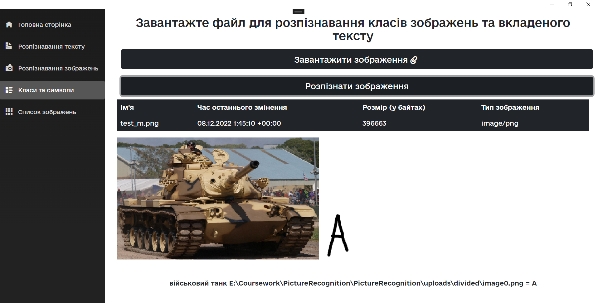
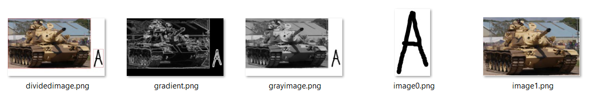
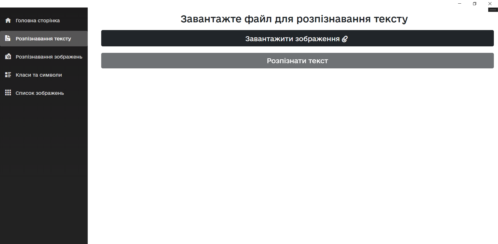
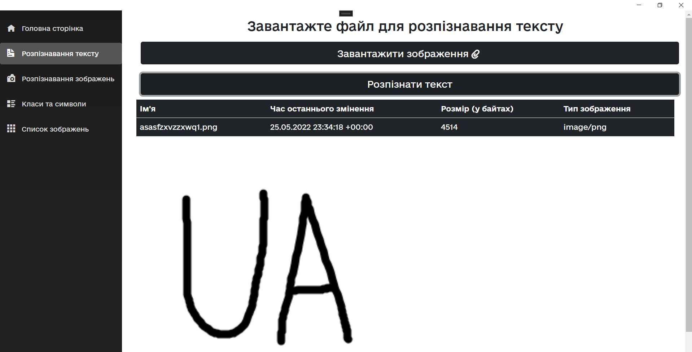
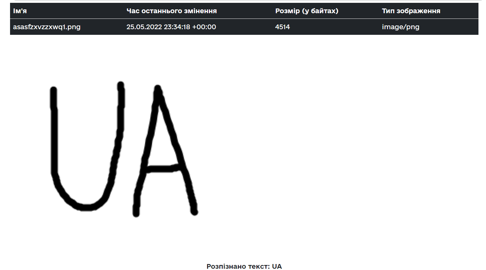
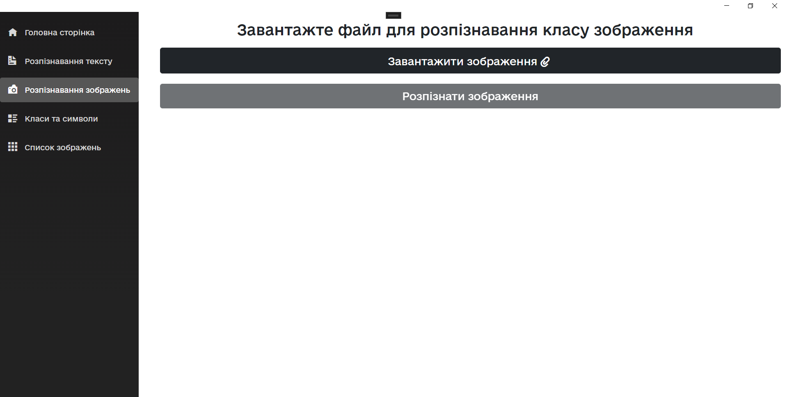
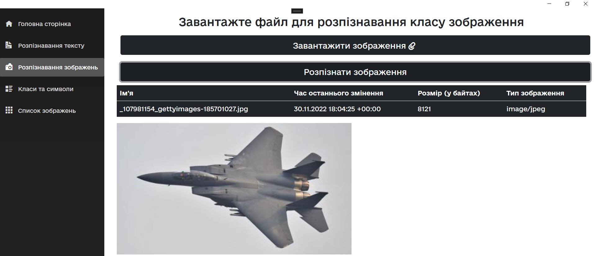
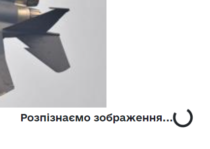
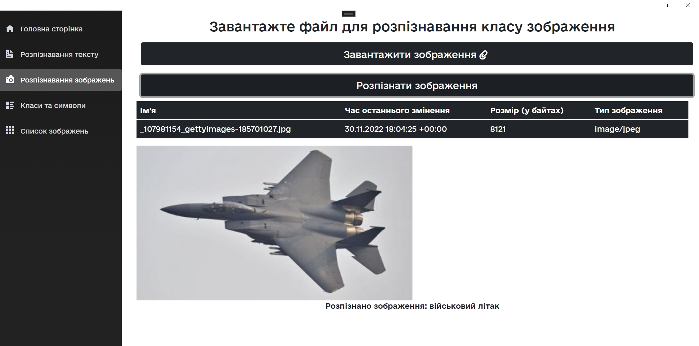

# Створення застосунку для розпізнавання рукописного тексту та зображень


## Автор
***Самардак Н.Б.***, *студент 2 курсу магістратури, кафедра програмування, Львівський Національний Університет ім. Івана Франка.*  
***Науковий керівник: Пасічник Т.В.***, *кандидат ф.-м. н.,доцент кафедри програмування, Львівський Національний Університет ім. Івана Франка.*


## Нейромережі 

#### Модель нейронної мережі для розпізнавання символів
```python
emnist_labels = [48, 49, 50, 51, 52, 53, 54, 55, 56, 57, 65, 66, 67, 68, 69, 70, 71, 72, 73, 74, 75, 76, 77, 78, 79, 80, 81, 82, 83, 84, 85, 86, 87, 88, 89, 90, 97, 98, 99, 100, 101, 102, 103, 104, 105, 106, 107, 108, 109, 110, 111, 112, 113, 114, 115, 116, 117, 118, 119, 120, 121, 122]

def neiron_model():
    image_rows, image_cols = 28, 28
    model = Sequential(
        [
            Convolution2D(filters=32, kernel_size=(3, 3), padding='valid', input_shape=(image_rows, image_cols, 1), activation='relu'),
            Convolution2D(filters=64, kernel_size=(3, 3), activation='relu'),
            MaxPooling2D(pool_size=(2, 2)),
            Dropout(0.25),
            Flatten(),
            Dense(512, activation='relu'),
            Dropout(0.5),
            Dense(len(emnist_labels), activation='softmax')
        ]
    )
    model.compile(loss='categorical_crossentropy', optimizer='adadelta', metrics=['accuracy'])
    return model
```
#### Модель нейронної мережі для розпізнавання військових та цивільних транспортних засобів 

```python
classes = ['civilian aircraft','civilian car','military aircraft', 'military helicopter','military tank','military truck']
image_rows, image_cols = 256, 256
model = keras.models.Sequential([
    keras.layers.Conv2D(32, (3, 3), activation='relu', input_shape = [image_rows, image_cols,3]),
    keras.layers.MaxPooling2D(),
    keras.layers.Conv2D(64, (2, 2), activation='relu'),
    keras.layers.MaxPooling2D(),
    keras.layers.Conv2D(64, (2, 2), activation='relu'),
    keras.layers.Flatten(),
    keras.layers.Dense(100, activation='relu'),
    keras.layers.Dense(len(classes), activation ='softmax')
])
model.compile(optimizer='adam',
             loss = 'binary_crossentropy',
             metrics=['accuracy'])
```

## Використання

#### Розпізнавання тексту та зображення
Завантажимо файл що містить в собі транспортний засіб та вкладений рукописний текст.
В результаті користувач отримує який текст міститься у файлі та до якого класу належить вкладене зображення:

В результаті було отримано список розпізнаних символів. Для того щоб дізнатися чи правильно вони були розпізнані проаналізуємо зображення у файловій системі:

**В результаті виконання програми можна побачити що :**
•	зображення 0 це cимвол “А” – вірно.
•	зображення 1 це військовий танк – вірно.


#### Розпізнавання тексту
Перейдемо на сторінку розпізнавання тексту

Завантажимо файл що містить рукописний текст

**В результаті текст що міститься у файлі розпізнано правильно**


#### Розпізнавання та класифікація зображення
перейдемо до сторінки “Розпізнавання зображень”

завантажуємо файл то розпізнаємо зображення:

Коли користувач натискає кнопку відбувається надсилання запиту до Web-API та звідти запуск python модуля що розпізнає зображення. Це може зайняти якийсь час, тому було додати інтерфейс який вказує на те, що відбувається розпізнавання

В результаті отримуємо до якого класу зображення належить.

**Як бачимо в результаті зображення розпізнано правильно.**


